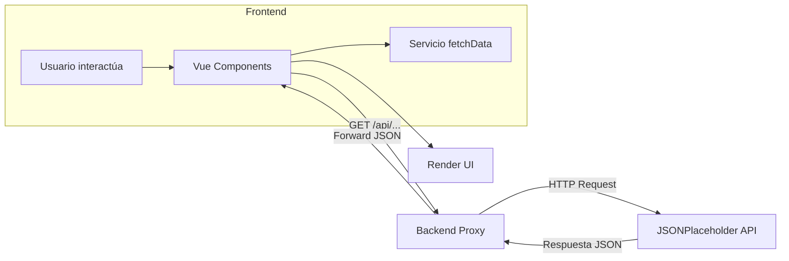

# JSONPlaceholder Explorer

**Descripción del proyecto**

JSONPlaceholder Explorer es una aplicación full-stack que consume la API de [JSONPlaceholder](https://jsonplaceholder.typicode.com) a través de un microservicio Express (backend) y muestra los datos en una interfaz construida con Vue 3 y Tailwind CSS (frontend). Permite explorar `Posts`, `Usuarios`, `Álbumes` y `Tareas`, filtrar resultados y recargar datos.

**Arquitectura**

```text
┌────────────┐       ┌───────────────┐       ┌──────────────────────────┐
│  Frontend  │  <--  │  Backend API  │  <--  │ JSONPlaceholder (externa)│
│ (Vue/Tail) │       │ (Express.js)  │       │ https://jsonplaceholder │
└────────────┘       └───────────────┘       └──────────────────────────┘
```

* **Frontend**: Vue 3 + Composition API, TailwindCSS para estilos, Vite como bundler.
* **Backend**: Node.js + Express, proxy a JSONPlaceholder con rutas `/api/posts`, `/api/users`, `/api/albums`, `/api/todos`.

**Decisiones técnicas**

* **Express como proxy**: Desacopla el consumo de la API pública y permite controlar cabeceras, caché y ETags.
* **Vue 3 + Composition API**: Facilita la lógica reactiva y la reutilización de hooks (p.ej. `loadData`).
* **Tailwind CSS**: Acelera maquetación y garantiza consistencia visual sin hojas de estilo complejas.
* **Testing**:

  * **Backend**: Jest + Supertest para test de rutas, asegurando un mínimo del 30 % de cobertura.
  * **Frontend**: Jest + Vue Test Utils + vue-jest para test de servicios y componentes.

**Instalación y ejecución**

1. Clonar repositorio:

   ```bash
   git clone <URL_DEL_REPOSITORIO>
   cd proyectofrontend
   ```

2. Backend:

   ```bash
   cd backend
   npm install
   # Ejecutar en modo desarrollo
   npm run dev
   # Ejecutar tests
   npm test
   ```

3. Frontend:

   ```bash
   cd front/proyectoapi
   npm install
   # Ejecutar en desarrollo con Vite
   npm run dev
   # Ejecutar tests unitarios
   npm run test:unit
   ```

4. Acceder al frontend en `http://localhost:5173` (o puerto que indique Vite).

**Diagrama de flujo simplificado**


